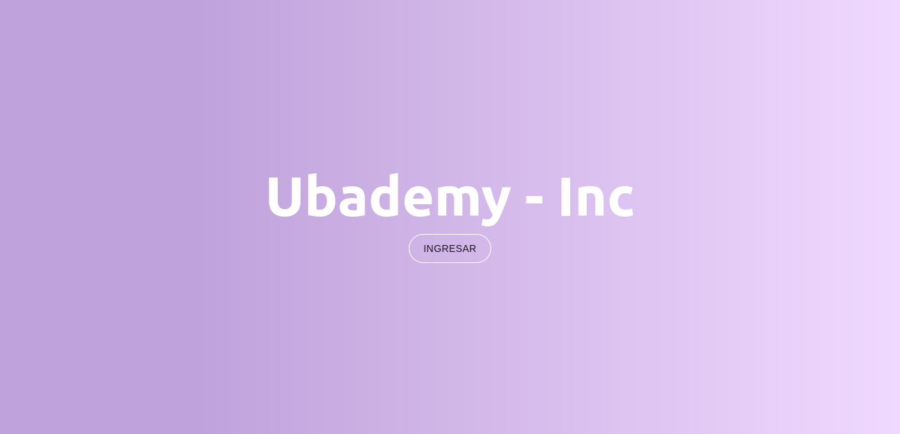
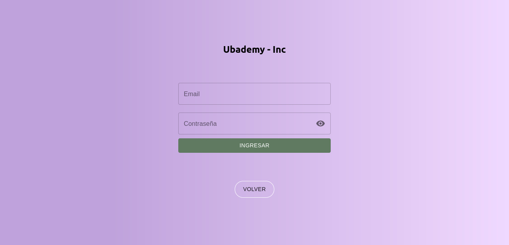
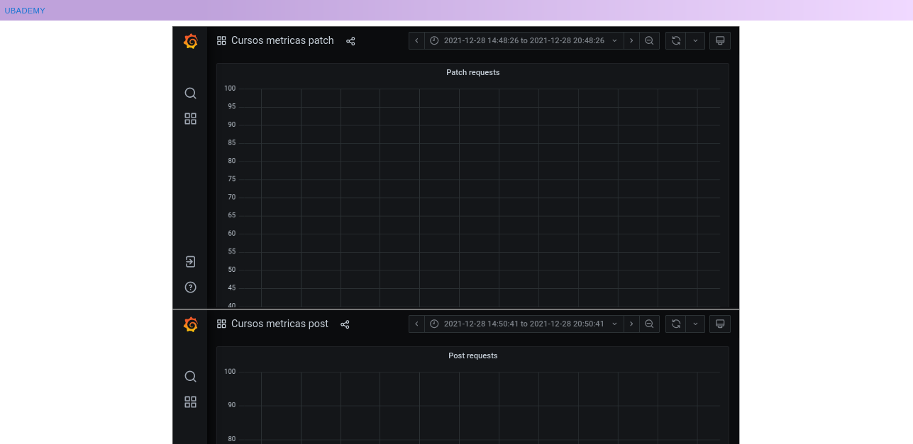
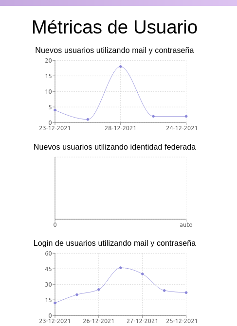
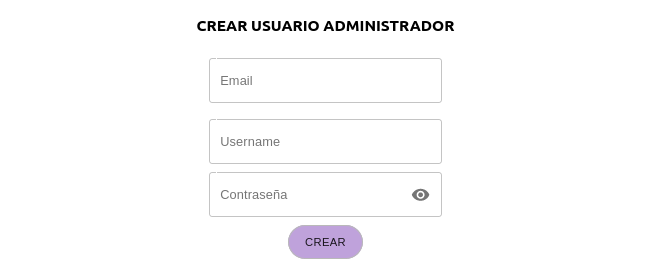
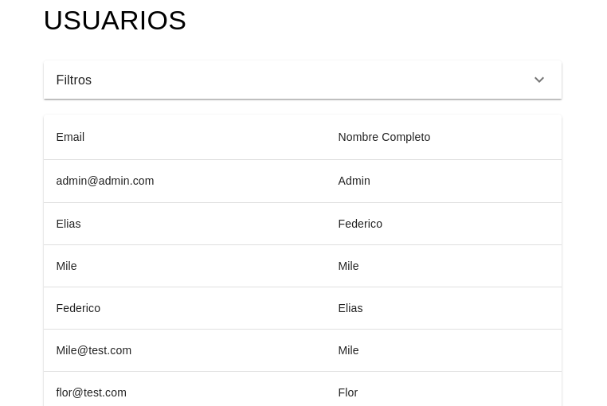

# Sitio Administrador

* [Link al servicio](https://ubademy-grupo-13.herokuapp.com/)

* [Link al repo](https://github.com/ubademy-inc/ubademy-front)

## Descripción

Este servicio es el frontOffice para los administradores del sitio Ubademy. A continuación se detallan las acciones que se pueden realizar en el mismo:

* Listar cursos creados y ver a los mismos
* Listar usuarios creados y ver a los mismos
* Visualizar métricas de usuarios y cursos
* Visualizar los servicios de la arquitectura
* Crear nuevos usuarios administradores

## Secciones

### Log in

### Métricas

### Listados

### Crear admin

