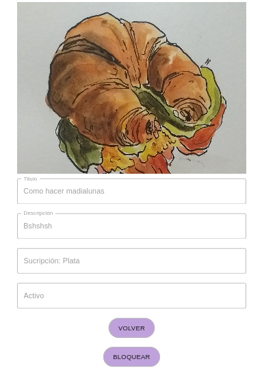

# Sitio Administrador

* [Link al servicio](https://ubademy-grupo-13.herokuapp.com/)

* [Link al repo](https://github.com/ubademy-inc/ubademy-front)

## Descripción

Este servicio es el frontOffice para los administradores del sitio Ubademy. A continuación se detallan las acciones que se pueden realizar en el mismo:

* Listar cursos creados y ver a los mismos
* Listar usuarios creados y ver a los mismos
* Visualizar métricas de usuarios y cursos
* Visualizar los servicios de la arquitectura
* Crear nuevos usuarios administradores

## Log in

Como solo un usuario administrador puede crear a otro. En la primera pantalla no se permite registrar un usuario, pero solamente ingresar de tener las credenciales correctas

## Usuarios

Si accedemos a Usuarios vamos a poder ver un listado con todos los usuarios.

Si se clickea uno, se puede ver toda la información del mismo

## Cursos

Si accedemos a Cursos vamos a poder ver un listado con todos los cursos.

Si se clickea uno, se puede ver la información resumida del mismo

En esta sección se puede además bloquear y desbloquear un curso. En caso de ser bloqueado, el curso podrá solamente ser visualizado en la app, pero lo usuario no podrán utilizarlo o anotarse al mismo.

## Métricas

Para las métricas se utilizaron dos acercamientos distintos para obtener y mostrar la información.

### Cursos

Si se accede a métricas de cursos se pueden ver las distintas mediciones en el servicio Grafana. Podemos acceder a información como la cantidad de actividad que tuvo cada endpoint en el tiempo indicando.

### Usuarios

Si se accede a métricas de usuarios se puede ver la actividad en el la app respecto a usuarios registrados e usuarios que ingresaron a la aplicación. La información se dividie, en ambos casos, por tipo de registro/login. Diferenciando los usuario que ingresan con entidades federadas (Google en nuestro caso) y los que lo hacen utilizando puramente nuestra aplicación.

## Crear usuario administrador

En esta sección se puede crear un nuevo usuario administrador. El mismo podrá ingresar a este mismo sitio y realizar todas las acciones antes mencionadas.

## Salir

Finalmente el menu da la opción de abandonar la sesión en el sitio, para poder in
gresar con uno nuevo o simplemente cerrar la sesión actual.