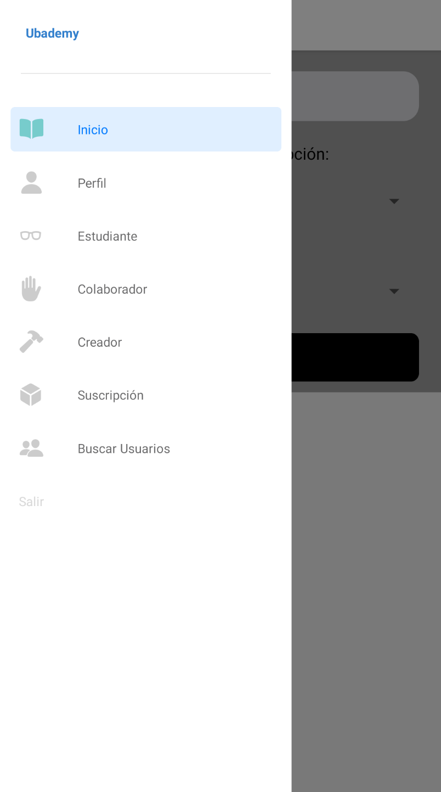

# Aplicación Movile

* [Link al repo](https://github.com/ubademy-inc/ubademy-app)

* [Link al maquetado](https://www.figma.com/file/FWvM5qmqIpvzVuXfd0QGhR/Ubademy?node-id=0%3A1)

## Inicio

Primero que nada, al entrar en la app verá las opciones de registrarse si no tiene cuenta o loggearse si ya tiene una:

## Login/Registro 

La app le permite al usuario registrarse tanto normalmente como mediante su cuenta de google.

## Buscador de Cursos
 
Una vez ingresado, el usuario puede buscar cualquier curso creado por su nombre, tipo de suscripción y/o tags asociados.

Si no se escribe ningún nombre, el buscador devolverá todos los cursos con los filtros de suscripción y tag elegidos.

## Drawer

Dentro de la App, el usuario tendrá varias opciones, mostradas mediante un navegador drawer:

## Perfil general

Aquí podrá ver sus datos como:

### Estudiante

### Creador

Creador, si no tiene creado un perfil de creador, le mostrará la opción de crearse uno. Al seleccionar crear, se le abrirá un modal para completar la información

Si ya tiene un perfil creado, le mostrará los valores de dichos campos llenados

## Colaborador

El perfil de colaborador funciona del mismo modo que el de creador.

# Acciones como estudiante

Aquí podrá ver los cursos a los que está anotado como estudiante,

a los cuales podrá acceder para dejar comentarios sin haber sido todavía inscripto al curso

## Acciones como Creador

Si no tiene perfil de creador creado, primero deberá crearse uno, esta página le dará dicha opción.

Si lo tiene, podrá acceder a todos los cursos que haya creado, o crear un nuevo curso.

### Curso creado

A cada curso podrá acceder para corregir exámenes, responder comentarios, asignar colaboradores o editar información de dicho curso

### Creación de Cursos

También podrá crear nuevos cursos, junto con sus exámenes

## Acciones como Colaborador

Si no tiene perfil de colaborador creado, primero deberá crearse uno, esta página le dará dicha opción.

 
Si lo tiene, podrá acceder a todos los cursos en los que esté anotado como colaborador

Podrá acceder a los mismos para corregir exámenes o responder comentarios. Se puede ver que tiene menos acciones disponibles que un creador.

## Suscripciones

En esta página se le indicará qué nivel de suscripción tiene comprado, y se le detallará las demás suscripciones que tenga disponibles para comprar

## Buscar otros usuarios
Aquí podrá ingresar el nombre del usuario que desee buscar y, de encontrarlo, podrá ver sus datos básicos:
* Nombre
* Apellido
* Email
* Nivel de suscripción
* Fecha de creación del perfil

## Cerrar sesión

Desde el drawer se da la opción de salir de la sesión

